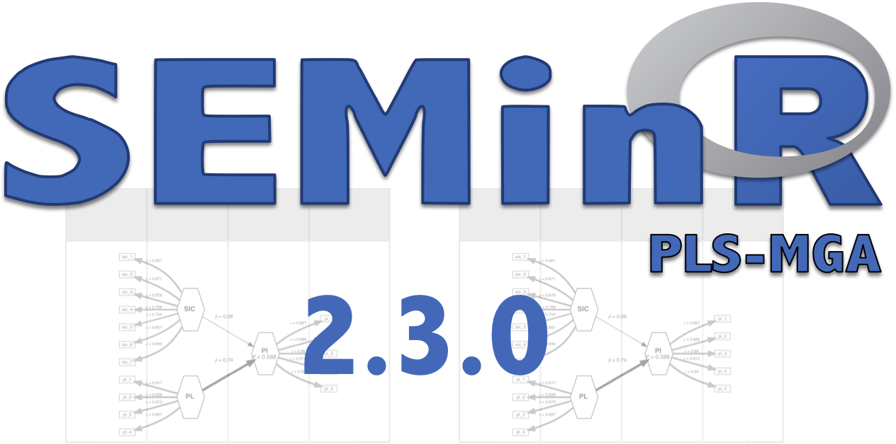

```{r setup, include=FALSE}
knitr::opts_chunk$set(echo = FALSE)
```



Happy New Year to our wonderful SEMinR community! SEMinR v2.3 is available for installation from CRAN, and it brings the most requested feature from our users: PLS-MGA. See a [quick demo](https://github.com/sem-in-r/seminr/blob/develop/demo/seminr-pls-mga.R) of how to use it or read the documentation for the new `estimate_pls_mga()` function after installation with `?estimate_pls_mga`.

Since we released of the major v2 of SEMinR over half a year ago, we have also fixed numerous issues reported by our esteemed users. In particular, we have addressed growing concerns about the instability of Consistent PLS (PLSc) across repeated runs. We have now made PLSc more stable to run in our iterative operations, from bootstrapping to our new PLS-MGA feature, and reported whether we had to discard iterations. We have also started addressing requests for more helpful error messages. Every time we now get an inquiry about a strange error, we take care to offer a more helpful message for future. Please keep sending us your [issues](https://github.com/sem-in-r/seminr/issues) and tips, and we will keep releasing fixes in our smaller patches.