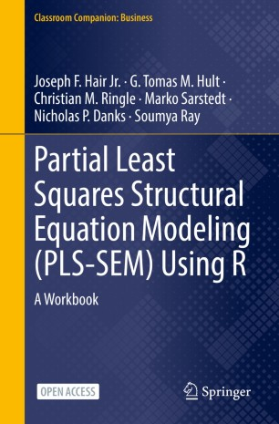

```{r setup, include=FALSE}
knitr::opts_chunk$set(echo = FALSE)
```

{width=50%}

Our textbook for PLS-SEM Using R has now reached over 45,000 downloads. Congratulations team! Marko Sarstedt, Christian M. Ringle, Joe Hair, Tomas Hult, Soumya Ray. Onwards and upwards!

[The book is completely open-access](https://link.springer.com/book/10.1007/978-3-030-80519-7) and is accompanied by SEMinR which is free to download. I encourage you to take a look!


