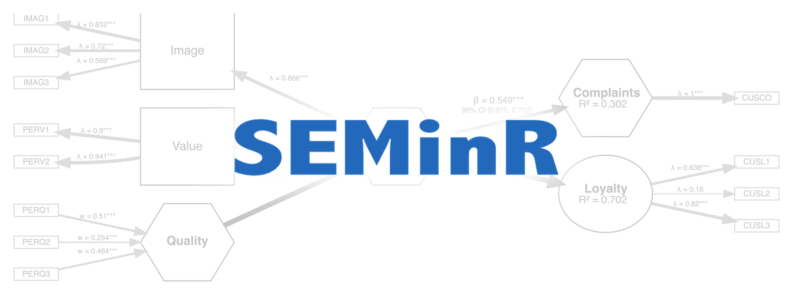
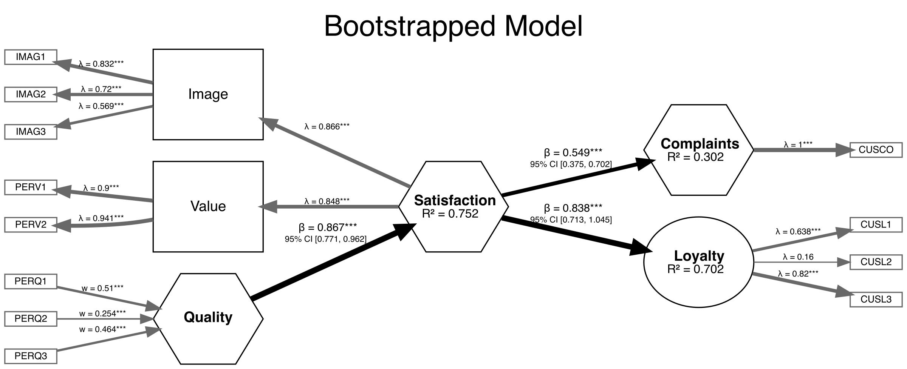

<style>
/* Homepage only: drop the auto-generated "Welcome to SEMinR" title and the
   byline divider beneath it, letting the logo lead the page. */
.d-title { display: none; }
d-byline { display: none; }
</style>



<div class="home-badges">
  <a href="https://cran.r-project.org/package=seminr"></a>
  <a href="https://cran.r-project.org/package=seminr"></a>
</div>

SEMinR allows users to easily create and modify structural equation models (SEM).  It allows estimation using either covariance-based SEM (CBSEM, such as LISREL/Lavaan), or Partial Least Squares Path Modeling (PLS-PM, such as SmartPLS/semPLS).

<div class="multilang-note">
  <span class="multilang-logos">
    
    
    
  </span>
  <span><strong>SEMinR speaks your language.</strong> Beyond the original R package,
  SEMinR is being ported to Python and TypeScript &mdash; both are
  <strong>experimental</strong> for now and validated against the R base for
  numerical parity. See the <a href="packages.html">Packages</a> page to get started.</span>
</div>

Main features of using SEMinR:

- A *natural* feeling, *domain-specific* language to build and estimate SEMs
- *High-level functions* to quickly specify interactions and complicated structural models
- *Modular design* of models that promotes reuse of model components
- Encourages *best practices* by use of smart defaults and warnings

Take a look at the easy syntax and modular design &mdash; the same model, in whichever language you prefer:

:::: {.code-tabs}
<div class="code-tabs-nav" role="tablist">
<button class="code-tab active" data-lang="r" type="button">R</button>
<button class="code-tab" data-lang="python" type="button">Python</button>
<button class="code-tab" data-lang="typescript" type="button">TypeScript</button>
</div>

::: {.code-panel .active data-lang="r"}
```r
# Define measurements with familiar terms: reflective, composite, multi-item constructs, etc.
measurements <- constructs(
  reflective("Image",      multi_items("IMAG", 1:5)),
  composite("Expectation", multi_items("CUEX", 1:3)),
  composite("Loyalty",     multi_items("CUSL", 1:3), weights = mode_B),
  composite("Complaints",  single_item("CUSCO"))
)

# Create four relationships (two regressions) in one line!
structure <- relationships(
  paths(from = c("Image", "Expectation"), to = c("Complaints", "Loyalty"))
)

# Estimate the model with PLS (Consistent PLS for the reflective construct)
pls_model <- estimate_pls(data = mobi, measurements, structure)

# Re-estimate the same model as purely reflective using CBSEM
cbsem_model <- estimate_cbsem(data = mobi, as.reflective(measurements), structure)
```
:::

::: {.code-panel data-lang="python"}
```python
from seminr import (
    constructs, reflective, composite, multi_items, single_item, mode_B,
    relationships, paths, estimate_pls, estimate_cbsem, as_reflective,
)
from seminr.datasets import load_mobi

mobi = load_mobi()

# Define measurements with familiar terms: reflective, composite, multi-item constructs, etc.
measurements = constructs(
    reflective("Image",      multi_items("IMAG", [1, 2, 3, 4, 5])),
    composite("Expectation", multi_items("CUEX", [1, 2, 3])),
    composite("Loyalty",     multi_items("CUSL", [1, 2, 3]), weights=mode_B),
    composite("Complaints",  single_item("CUSCO")),
)

# Create four relationships (two regressions) in one line!
structure = relationships(
    paths(["Image", "Expectation"], ["Complaints", "Loyalty"]),
)

# Estimate the model with PLS (Consistent PLS for the reflective construct)
pls_model = estimate_pls(mobi, measurements, structure)

# Re-estimate the same model as purely reflective using CBSEM
cbsem_model = estimate_cbsem(mobi, as_reflective(measurements), structure)
```
:::

::: {.code-panel data-lang="typescript"}
```typescript
import {
  parseCsv, constructs, reflective, composite, multiItems, singleItem, modeB,
  relationships, paths, estimatePls, estimateCbsem, asReflective,
} from "@seminr/core";

// Load your data — any way of obtaining CSV text works
const mobi = parseCsv(await Bun.file("mobi.csv").text());

// Define measurements with familiar terms: reflective, composite, multi-item constructs, etc.
const measurements = constructs(
  reflective("Image",      multiItems("IMAG", [1, 2, 3, 4, 5])),
  composite("Expectation", multiItems("CUEX", [1, 2, 3])),
  composite("Loyalty",     multiItems("CUSL", [1, 2, 3]), modeB),
  composite("Complaints",  singleItem("CUSCO")),
);

// Create four relationships (two regressions) in one line!
const structure = relationships(
  paths(["Image", "Expectation"], ["Complaints", "Loyalty"]),
);

// Estimate the model with PLS (Consistent PLS for the reflective construct)
const plsModel = estimatePls(mobi, measurements, structure);

// Re-estimate the same model as purely reflective using CBSEM
const cbsemModel = estimateCbsem(mobi, asReflective(measurements), structure);
```
:::
::::

<script>
document.querySelectorAll('.code-tabs').forEach(function (tabs) {
  var buttons = tabs.querySelectorAll('.code-tab');
  var panels = tabs.querySelectorAll('.code-panel');
  buttons.forEach(function (button) {
    button.addEventListener('click', function () {
      var lang = button.getAttribute('data-lang');
      buttons.forEach(function (b) { b.classList.toggle('active', b === button); });
      panels.forEach(function (p) { p.classList.toggle('active', p.getAttribute('data-lang') === lang); });
    });
  });
});
</script>

## One model, several estimators

Specify a model once, then estimate it with the technique that fits your question:

- **Partial Least Squares Path Modeling (PLS-PM)** — variance-based estimation of composites and common factors, automatically switching to *Consistent PLS (PLSc)* for reflective constructs, with bias-corrected interactions, *out-of-sample prediction* via PLSpredict, and high-performance multi-core bootstrapping.
- **Covariance-based SEM (CBSEM)** — covariance-based estimation via the [lavaan](https://lavaan.ugent.be) package, with interactions, ten Berge factor-score extraction, and VIF and other validity assessments.
- **Confirmatory Factor Analysis (CFA)** — evaluate just the measurement model, returning both results and the underlying lavaan syntax.

SEMinR is continuously tested against leading SEM software — SmartPLS, ADANCO, semPLS, and matrixpls — to ensure parity of outcomes.

## Visualize your models

Plot any supported model with a simple `plot()` method and save it to file, with customizable themes:



## Modeling features

SEMinR goes well beyond simple path models, with high-level functions for the
techniques modern SEM research relies on:

- **Interactions &amp; moderation** — add `interaction_term()`s using any of three methods (`two_stage`, `product_indicator`, or `orthogonal`), or `quadratic_term()`s, with known biases in PLS interaction estimates automatically corrected.
- **Higher-order constructs** — build second-order composites and common factors with `higher_composite()` via the two-stage approach.
- **Mediation &amp; moderation analysis** — specify and assess mediating and moderating relationships in both PLS-PM and CBSEM.
- **Multi-group analysis (PLS-MGA)** — test whether structural paths differ significantly across subgroups of your data.
- **Out-of-sample prediction (PLSpredict)** — generate predictions with k-fold cross-validation or LOOCV across all interaction methods, with multi-core parallelization.
- **Comprehensive assessment** — reliability (Cronbach's α, ρA, ρC, AVE), discriminant validity (HTMT, Fornell–Larcker, cross-loadings), collinearity (VIF), and effect sizes (f²) come built in.
- **And much more via [seminrExtras](extras.html)** — composite overfit analysis (COA), congruence testing, CVPAT predictive testing, mediator predictive contribution (PCM), importance-performance analysis (IPMA & cIPMA), necessary condition analysis (NCA), confirmatory tetrad analysis (CTA-PLS), and unobserved heterogeneity (FIMIX & PLS-POS).
