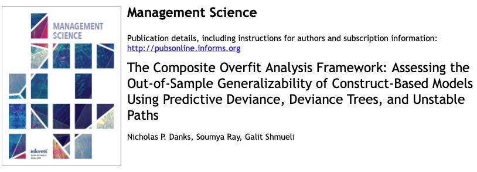

After years of hard work, and unending support and guidance from my mentors Soumya Ray and Galit Shmueli, I am very pleased to announce that my article — and the bulk of my dissertation work — is now published.

It is titled **["The Composite Overfit Analysis Framework: Assessing the Out-of-Sample Generalizability of Construct-Based Models Using Predictive Deviance, Deviance Trees, and Unstable Paths"](https://pubsonline.informs.org/doi/abs/10.1287/mnsc.2023.4705)** by Nicholas P. Danks, Soumya Ray, and Galit Shmueli, in *Management Science*.

[The article is available online](https://pubsonline.informs.org/doi/abs/10.1287/mnsc.2023.4705), or you can request a copy by finding my profile on ResearchGate.
