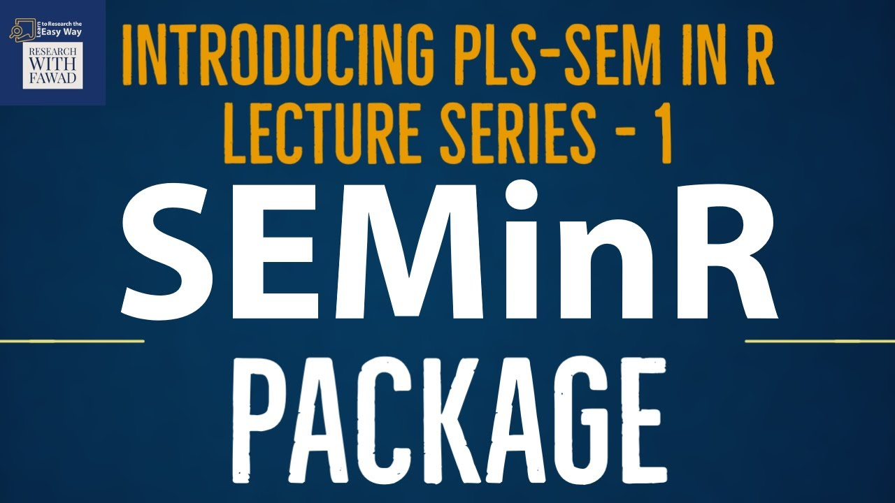
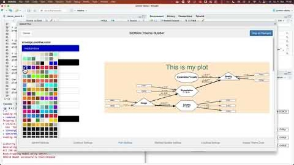

Whether you are just getting started with PLS-SEM or troubleshooting a tricky
model, these resources will help you learn SEMinR, ask good questions, and reach
the developers.

# Learn

### Partial Least Squares Structural Equation Modeling (PLS-SEM) Using R: A Workbook {.resource-title}

::: {.book-entry}

The definitive companion for learning PLS-SEM with SEMinR. Written by Joseph F.
Hair, G. Tomas M. Hult, Christian M. Ringle, Marko Sarstedt, Nicholas P. Danks,
and Soumya Ray, this
workbook walks through the full modeling workflow — from specifying constructs
to assessing measurement and structural models — using SEMinR throughout. It is
**completely open-access and free to download**, and has been downloaded well
over 45,000 times.

- [Read or download the book (Springer, open access)](https://link.springer.com/book/10.1007/978-3-030-80519-7)
- [Concise R code and outputs for the book's examples](/workbook/)
:::

### SEMinR Lecture Series (video course) {.resource-title}

::: {.book-entry}

A free, step-by-step YouTube course on running PLS-SEM in R with SEMinR. The
lectures walk through installing R and SEMinR, specifying measurement and
structural models, estimating PLS-SEM, and printing, exporting, and plotting
your results — a natural companion to the workbook above.

- [Watch the SEMinR Lecture Series on YouTube](https://www.youtube.com/playlist?list=PLb7vm6tsQ3Ks0TyMWw3EUlgoMr06_7U8S)
:::

### Quick Theming Tutorial (video) {.resource-title}

::: {.book-entry}

A short walkthrough from SEMinR package author
[André Calero Valdez](https://calerovaldez.com/) showing how to restyle your
model diagrams — colours, node and edge styling, and labels — using SEMinR's
theming tools and the interactive Theme Builder, so your plots match your paper
or presentation.

- [Watch the Quick Theming Tutorial on YouTube](https://www.youtube.com/watch?v=epTFlfT9SGg)
:::

# Ask questions

::: {.book-entry}

The friendliest place to ask questions, share your work, and discuss PLS-SEM and
CBSEM with the developers and other users.

- [SEMinR user community on Facebook](https://www.facebook.com/groups/seminr)
:::

# Report bugs & request features

Each language port has its own GitHub issue tracker. Please file bugs and
feature requests against the repository for the version you are using.

- **R** — [sem-in-r/seminr issues](https://github.com/sem-in-r/seminr/issues)
- **Python** — [sem-in-r/seminr-py issues](https://github.com/sem-in-r/seminr-py/issues)
- **JavaScript / TypeScript** — [sem-in-r/seminr-ts issues](https://github.com/sem-in-r/seminr-ts/issues)
